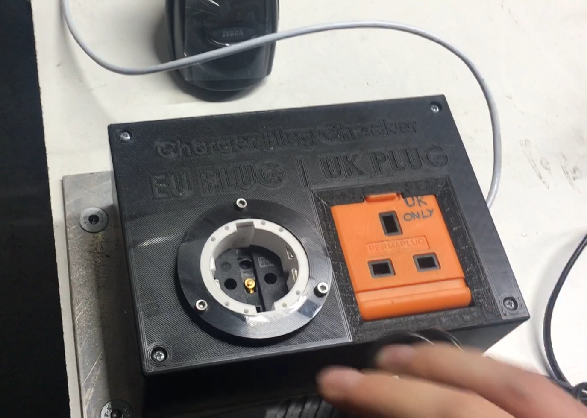
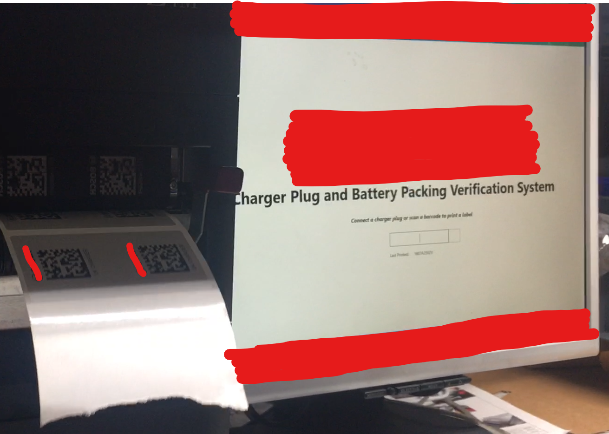
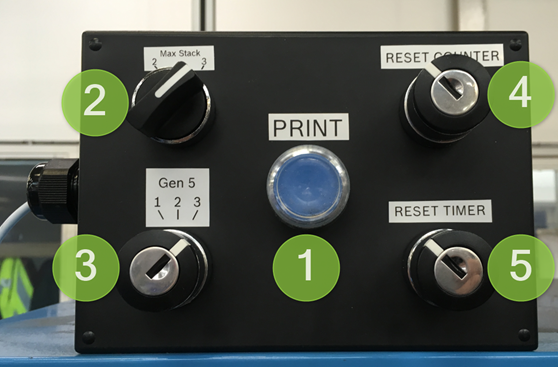

# This is a collection of Arduino sketches
## charger_plug_checker.ino
Deployed to a plug checking device on an electro-mechanical device assembly line packing station. Checks for electrical continuity on each plug socket, which is made when the appropriate UK or European plug battery charger is fitted into a 3D printed fixture containing the Arduino Micro. The resulting behaviour is to output strings as keyboard strokes to be picked up by an application running on the PC that the Arduino is plugged into. The application (built in Nicelabel) then uses this input to determine the correct label template, automatically assign date/serial numbers, and print a label using the attached thermal printer.

The system was entirely designed and built by me to address risks identified in the assembly process.

## pallet_labeller.ino
Deployed to a palletising station at the end of an assembly line. Working in a similar way to the charger plug checker, this script processes inputs from the control box and outputs keyboard strings to an application, which then prints a label with the appropriate template and values. The 3D printed fixture containing the Arduino Micro has a 3-way switch (assembly line selection 1-3), a 2-way switch (stack size), momentary key switches (counter/timer reset) and a momentary pushbutton (print). The Arduino interprets these inputs and sends a concatenated keyboard input to an application (built in Nicelabel) where the label template values are set, the counter is incremented, and an A4 label is printed to label the pallet. 

The system was entirely designed and built by me to automate the palletisation labelling process.

## pcb_checker
A simple script with 2 momentary button inputs and 2 LED outputs. The 3D printed fixture would only allow the buttons to be pressed if the PCB was fitted to the assembly correctly, at which point the fixture would light green to indicate an acceptable result.

This system was developed together with an engineering intern as a mentorship project.

## mute_button
A quick solution to turn a single buttonputton input into a 'win+z' keyboard input. This was picked up by Autohotkey as a way to mute the mic in Teams.
